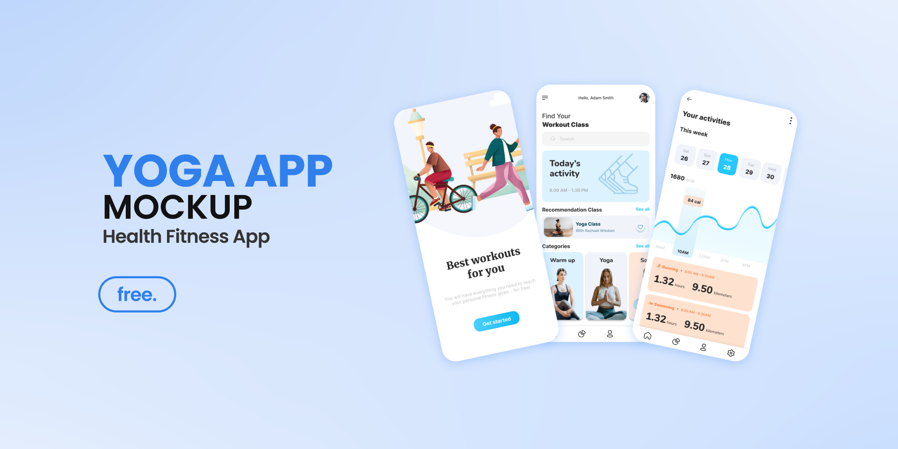
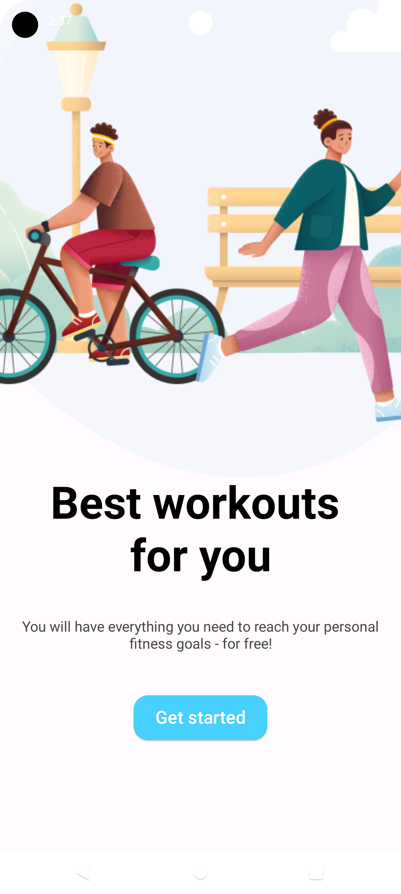
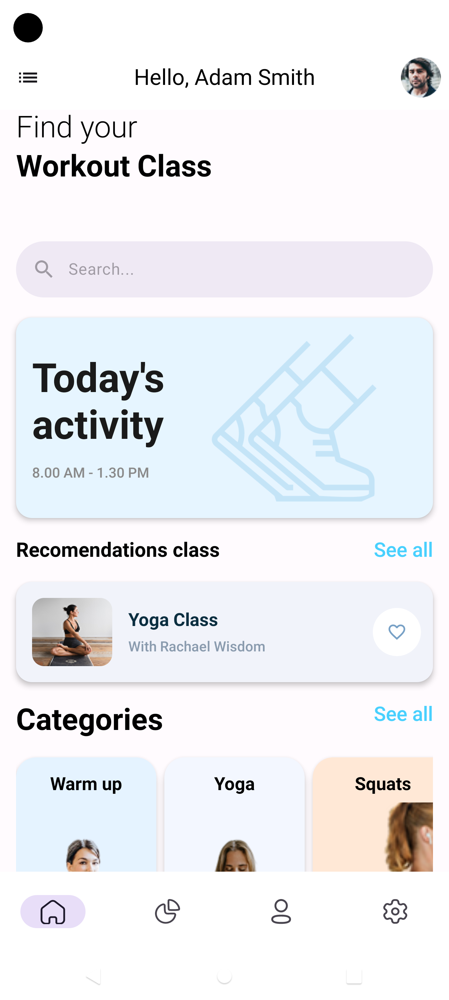
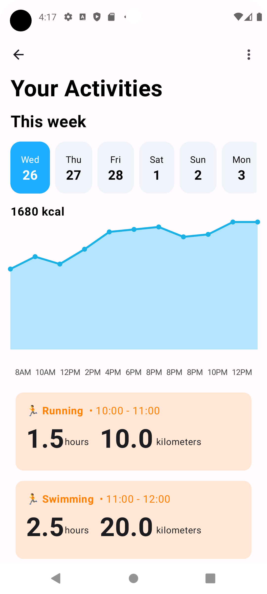
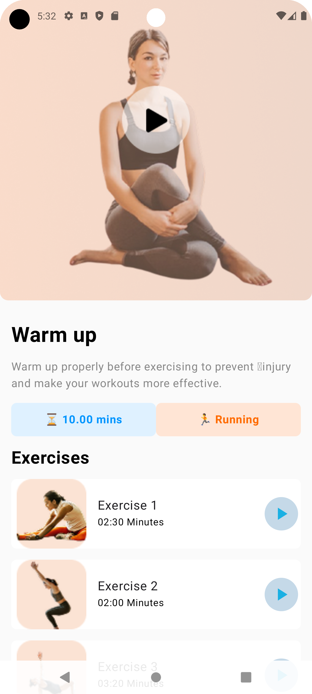

# DESIGN

 

https://www.figma.com/design/CxjwTOJuemzAdncSnzIBqz/Health-Fitness-Workout-App-(FREEBIE---Prototype)-(Community)?node-id=303-779&t=pWBzL7kkw4lvIut5-1

> [!Warning]
> # Only 4 screens are finished, the rest will be done soon.

 > [!Warning]
> # The app only supports portrait orientation.

# Capturas

| screen 1 | screen 2 |  
| -------- | -------- |
|  |  |

| screen 3 | screen 4 |  
| -------- | -------- |
|  |  |

